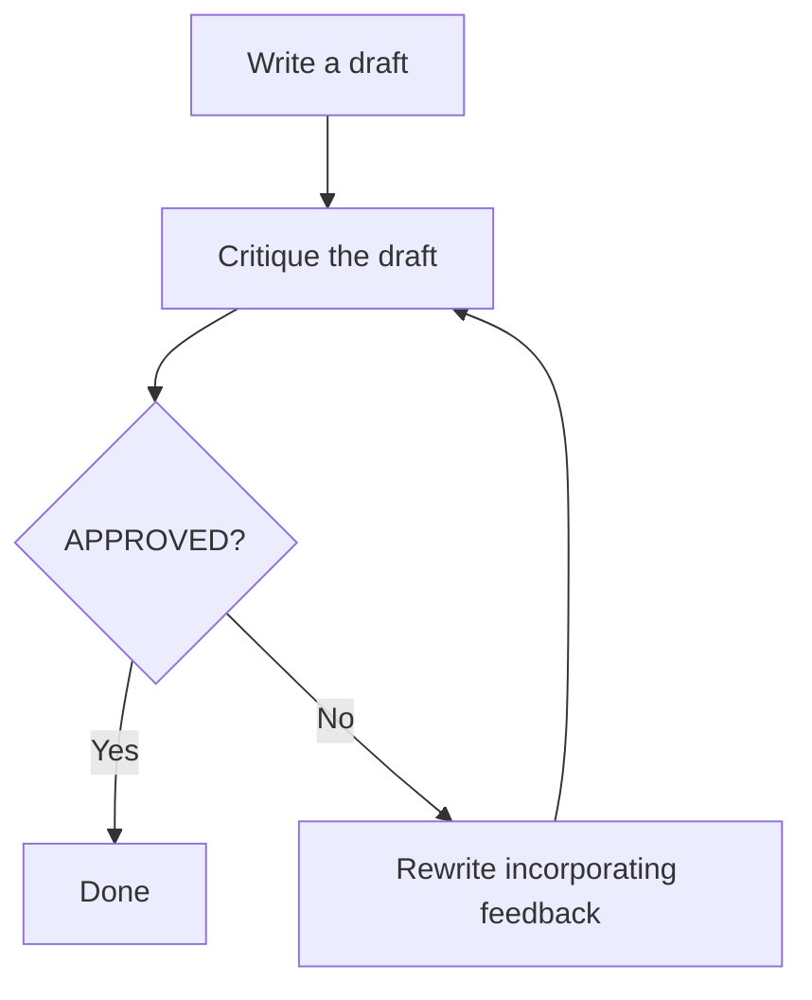

# AI@Home with Gemma

*With a $500 mini-PC and an open model, the AI that once lived only in data centers now runs in your garage, your village, your workplace — and it's surprisingly good.*

---

## The Moment Everything Changed

For the past few years, the most capable AI was delivered via API calls. You typed a question, it traveled to a data center somewhere, a thousand-dollar GPU thought about it, and the answer came back. Remarkable — but not yours. Not local. Not private. Not free.

That changed quietly with the release of Gemma 4.

Google's Gemma 4 family — particularly the e2b and e4b variants — crossed a threshold. These are models small enough to run on a single consumer machine, open enough to download and keep, and capable enough to do real work. Not toy work. Not "summarize this paragraph" work. Genuine multi-step reasoning, structured writing, self-critique — the kind of cognitive labor that used to require a cloud subscription.

But to understand why this moment matters, you have to know how long the road here actually was.

---

## A Decade in the Making: 2017 to 2026

The story of AI coming home begins not in a garage, but in a Google research paper.

### 2017 — "Attention Is All You Need"

In June 2017, eight Google researchers published a paper with a deceptively modest title: *"Attention Is All You Need."* It introduced the **Transformer architecture** — a new way of processing language where every word attends to every other word simultaneously, rather than reading left to right like previous models.

Nobody outside of research circles noticed. No product launched. No press release. Just a PDF on arXiv.org.

That paper is now the foundation of every large language model in existence. GPT, Gemma, Claude, LLaMA — every one of them is a Transformer. The authors gave away the blueprint for the AI decade that followed.

### 2018–2020 — OpenAI Scales the Blueprint

OpenAI took the Transformer and asked a simple question: what happens if you make it bigger and feed it more text?

**GPT-1** (2018) — 117 million parameters. Interesting but limited. Mostly a research curiosity.

**GPT-2** (2019) — 1.5 billion parameters. OpenAI was so concerned about misuse they initially refused to release it. In hindsight, the concern was premature — but it signaled that something qualitatively different was emerging.

**GPT-3** (2020) — 175 billion parameters. The first model that genuinely surprised people. You could give it a few examples of a task and it would generalize. It could write code, translate languages, answer questions, and compose essays — without being explicitly trained on any of those tasks. Researchers called this "emergent capability." Everyone else called it uncanny.

GPT-3 was still locked behind an API. Still a cloud service. Still not yours.

### 2022 — The ChatGPT Moment

In November 2022, OpenAI wrapped GPT-3.5 in a chat interface and called it **ChatGPT**. Within five days it had one million users. Within two months, one hundred million. It was the fastest consumer product adoption in history.

Something shifted in the public consciousness. AI was no longer a research topic or a science fiction premise. It was a thing you could open in a browser tab and have a conversation with. Developers, students, writers, doctors, teachers — everyone suddenly had a direct line to a model that could reason, explain, and create.

The cloud wall was still there. But now everyone could see clearly what was on the other side of it.

### 2023–2024 — The Open Infrastructure Revolution

The release of Meta's **LLaMA** weights in early 2023 — initially leaked, then officially released — started a cascade. Suddenly anyone with technical skill could run a capable model locally. But weights alone are not enough. What turned LLaMA from a research artifact into a tool anyone could use was a wave of open infrastructure built by the community.

**llama.cpp**, created by Georgi Gerganov, deserves special recognition. Within days of the LLaMA release, Gerganov — working alone — rewrote the inference engine in pure C++, with no dependencies, runnable on a laptop CPU. He introduced **quantization** techniques that compress model weights from 16-bit floats down to 4-bit integers, shrinking a 7-billion-parameter model from 13 GB to under 4 GB with minimal quality loss. This was the technical unlock that made AI genuinely portable. Without llama.cpp, "running AI locally" would have remained the domain of people with research-grade workstations.

**Ollama** wrapped this power in a dead-simple interface. One command — `ollama run gemma4:e2b` — downloads the model and starts a local API server compatible with the OpenAI standard — ready to chat. No Docker expertise. No CUDA configuration. No dependency hell. Ollama turned what had been a multi-hour setup into a five-minute task, and in doing so opened local AI to a vastly larger audience. It is the layer that made "AI at home" feel like a real product rather than a weekend project.

**vLLM**, developed at UC Berkeley, solved a different problem: how do you serve large language models efficiently when multiple users are making requests simultaneously? Its key innovation — **PagedAttention** — manages the model's memory the way an operating system manages RAM, allowing far more concurrent requests without wasting GPU memory. While llama.cpp and Ollama target individual users, vLLM targets small teams and organizations running their own on-prem inference servers. Together, these three projects cover the full spectrum: from a single developer's laptop to a company's on-prem AI infrastructure.

None of these tools were built by the companies that created the underlying models. They were built by researchers, engineers, and individual contributors who believed that AI capability should not be gated behind a giant data center. The open-source ecosystem delivered on that belief.

But the gap between the best open models and the frontier models closed slowly. Running LLaMA locally meant accepting a significant quality penalty compared to GPT-4. For casual use, fine. For real work, frustrating.

### 2025–2026 — Claude Code and the New Interface

Step back and look at how humans have communicated with machines over the past seventy years.

In the beginning there was the **command line** — precise, powerful, unforgiving. You spoke the machine's language or nothing happened. Then came the **graphical interface** — point, click, drag. You no longer needed to memorize syntax. Millions more people gained access to computing.

Each shift was not just a convenience improvement. It was a fundamental expansion of who could participate and how human and machine can communicate.

Natural language is the third shift. And it is different from the first two in one profound way: **the machine now talks back.**

A command line executes. A GUI responds. But a natural language interface *reasons* — it asks clarifying questions, explains its choices, catches your contradictions, and tells you when something won't work the way you think it will. The interface has become a conversation.

This is what Anthropic built with **Claude Code**. Not an autocomplete tool. Not a "vibe coding" shortcut. A genuine reasoning partner for software development — one that reads entire codebases, understands architecture, plans changes across multiple files, runs tests, interprets errors, and iterates. It operates the way a thoughtful senior engineer would: understanding context before acting, checking its own work, and pushing back when the direction is unclear.

To be precise: Claude Code runs as a CLI on your machine, but its reasoning calls go to Anthropic's servers. It is cloud-native NDD — the ceiling that local NDD is working toward. The code it runs, the files it edits, the tests it executes — all local. The thinking happens in the cloud.

We call this pattern **Natural-language Driven Development (NDD)** — not because natural language replaces engineering judgment, but because it becomes the primary interface through which that judgment is expressed and acted upon. The programmer's role shifts from writing syntax to directing intent. The machine's role shifts from executing instructions to understanding them.

NDD is not a distant future. The benchmark in this article — the self-refine loop, the prompt logging, the benchmark script, the bug fixes — was built collaboratively with Claude Code in a single session. The human provided direction, context, and judgment. The AI provided implementation, caught its own errors, and explained every change. Neither could have produced the result as quickly alone.

That is cloud-native NDD at its best. The local version is what this article is actually about — and it is catching up.

### 2026 — Gemma 4 Brings AI Home

Which brings us to Gemma 4.

Google has taken everything learned from the Transformer revolution, the scaling experiments, the open model race, and the agentic breakthroughs — and distilled it into models small enough to run on modest hardware. The e2b variant has 2 billion parameters. The e4b has 4 billion.

Gemma 4 is released under the **Apache 2.0 license** — and this matters more than it might seem. Apache 2.0 is one of the most permissive open-source licenses in existence. It means you can download the model, use it commercially, modify it, build products with it, and distribute it — all without paying a fee or asking permission. The only requirement is attribution: acknowledge that the work originated with Google. There is no "copyleft" clause requiring you to open-source anything you build on top of it, unlike licenses such as GPL.

For AI at home, Apache 2.0 is the legal equivalent of the quantization breakthrough: it removes a barrier. You are not renting access to Gemma 4. You own a copy. You can run it in a hospital without sending patient data to a cloud. You can build a commercial product without negotiating a license. You can share it with a colleague in another country without worrying about export restrictions on proprietary software. Openness at the model level, protected by the right license, is what makes "AI at home" a durable reality rather than a temporary loophole.

The journey from that 2017 research paper to a model on your own machine took almost exactly a decade. It passed through billion-dollar compute budgets, landmark research labs, and the fastest product adoption in history. And it arrived, quietly, as a file you can download freely.

This is the story of what that actually looks like when you run it.

---

## What "AI at Home" Really Means

Let's be concrete. Running locally means the model weights sit on your machine. No internet required after setup. No API key and token charges. No data leaving your house.

The software stack is equally accessible:

- **[Ollama](https://ollama.com)** — one command to download and serve any open model locally
- **[LangGraph](https://github.com/langchain-ai/langgraph)** — Python library for building multi-step AI workflows
- A task. Any task.

That's it. No cloud account. No API key. No monthly bill.

---

## The Experiment: Teaching AI to Improve Its Own Work

To test what local models can actually do, we ran a classic agentic pattern called **self-refine** — an AI loop where the model writes something, then critiques it, then rewrites it based on its own critique, repeating until satisfied.

It looks like this:



This is not a single prompt. It is a small agentic workflow — the model acting as both writer and editor roles, iterating toward quality. It is, in miniature, how a thoughtful person actually works.

The task we gave every model: *"What are the benefits of meditation?"*

We ran it on five models: **llama3.2**, **gemma3**, **gemma4:e2b**, **gemma4:e4b**, and **Claude Sonnet 4.6** (via Claude Code — CLI local, inference cloud). The first four ran entirely on local hardware via Ollama. Claude served as the cloud ceiling — what the best available model produces on the same task.

---

## What Happened

### The Numbers

| Model | LLM Calls | Time | Refinements | Exit |
|-------|-----------|------|-------------|------|
| Claude Sonnet 4.6 | 2 | 81s | 0 | approved immediately |
| llama3.2 | 2 | ~13s | 0 | approved immediately |
| gemma3 | 4 | ~4 min | 1 | approved after 1 refinement |
| gemma4:e2b | 8 | ~9 min | 3 | hit max — never approved |
| gemma4:e4b | 8 | ~17 min | 3 | hit max — never approved |

*All local runs via Ollama on CPU, default quantization (Q4_K_M), default sampling (temperature 0.8, top_p 0.9). Each model acted as both writer and critic — a same-model design that measures self-critique capacity; see "The Real Finding" for the methodological implication. Claude Sonnet 4.6 ran via Claude Code (cloud inference) as the ceiling — chosen over Opus for cost efficiency on a development benchmark. The 8-call models spent ~17 min total, but per-call latency is comparable to the faster models — the difference is depth of thought, not raw token speed.*

Three things stand out immediately.

First: **llama3.2 finished fastest and produced the worst output.** It approved its own mediocre prose on the first critique — no suggestions, just `[APPROVED]`. Fast exit, zero self-criticism.

Second: **gemma3 gave genuine feedback on round one, improved the draft, then approved with a list of twelve complaints.** That "twelve suggestions + approved" pattern is telling: the critic can identify weaknesses but doesn't hold itself to fixing them. One honest improvement followed by a polite exit.

Third: **both gemma4 models refused to approve their own work across all three iterations.** Each round produced a measurably better article, but the critic's standard moved with the output. Seventeen minutes of relentless self-critique for the e4b. Nine for the e2b. Neither was satisfied.

---

### The Outputs

Here is what each model actually produced.

**llama3.2** wrote a nine-section article — accurate, flat, no markdown formatting. No thesis, just a list of benefits stated as facts. The critique was a single word: `[APPROVED]`. Not a single suggestion. The critic applied no standard at all.

**gemma3** wrote a formatted article with science-backed framing — cortisol, neuroplasticity, MBSR for depression — structured like a wellness magazine piece. The first critique gave six actionable suggestions, and the refinement was genuine: the MBSR section gained a mechanism, the pain section expanded, and the meditation types were reorganized thematically. Then the second critique listed twelve issues and still said approved. The model identified its own weaknesses clearly — and chose to exit anyway.

**gemma4:e2b** — a 2-billion-parameter model — wrote a genuinely professional five-section piece on the first pass: cognitive clarity, emotional regulation, physical health, mindfulness, compassion. Its structure was immediately better than any other local first draft. Then it ran three rounds of self-critique and still wouldn't approve itself. Each iteration produced real improvements: a sharper opening (*"stress is no longer an occasional visitor; it is the persistent hum of modern existence"*), a stronger causal chain through cardiovascular health, a more direct call to action. The final article is clean, confident, and publishable. It just never satisfied its own critic.

**gemma4:e4b** wrote the most ambitious initial draft — structured with emoji section headers, numbered sub-points, and unusually deep scientific content including the HPA axis, cortisol management, and pain gate theory. The first critique was its sharpest: remove the emojis for a professional feel, add a transitional paragraph between intro and body, explain "non-reactivity" with a concrete analogy, end with a measurable commitment. The model did all of it. Three rounds of revision transformed a listicle into a polished essay with a strong narrative voice and a specific closing challenge: *"For the next seven days, dedicate three minutes to mindful breathing immediately upon waking."* Still not approved. The final article is the best of the local models — and the most expensive to produce.

**Claude Sonnet 4.6** wrote a 1,600-word article on the first try. Named citations. Careful evidence qualification — distinguishing well-replicated findings from preliminary ones. A section on spiritual and existential benefits. A closing line that lands: *"The question is no longer whether meditation works. The question is why more people are not doing it."* The critic read it and immediately said: approved.

---

### The Real Finding

The most important result is not which model wrote the best article. It is this:

**The self-critique faculty scales with model quality — and it matters more than raw generation.**

llama3.2 has no meaningful critic at all: it approved a flat, generic draft without a single suggestion. gemma3's critic can identify real problems but lacks the discipline to withhold approval. Both gemma4 models hold themselves to a standard they can't quite clear in three iterations — which is actually the right behavior for a self-improvement loop. Claude sets a standard so high that its first draft clears it immediately.

The loop only improves what the critic is willing to reject. A weak critic produces fast exits and mediocre outputs. A strict critic produces better work — but costs more time. The gemma4 family is now in the "strict critic" tier, running entirely on your own hardware.

One design note: this benchmark intentionally used the same model as both writer and critic. On CPU-only hardware, swapping between two different models means unloading one set of weights and loading another — adding minutes of overhead per iteration on top of an already slow loop. Using a single model keeps the benchmark reproducible and the timing honest. The tradeoff is that each model's critic is calibrated to its own generation capacity; a cross-model condition (gemma4 as critic on llama3.2's draft) would be a natural extension and is on the roadmap.

One practical caveat: if the critic prompt is calibrated for a stronger model than the writer, you can get **systemic perfectionism** — the critic perpetually identifies problems the writer cannot fix at its current capacity, and the loop never converges. The fix is a higher `max_iterations` budget, a stronger writer model, or a slightly more lenient critic prompt. In our benchmark, three iterations was enough to see the pattern clearly; production use cases may need tuning.

This is a fundamentally human dynamic, playing out in a model running on your machine at home.

---

## Gemma 4: The Capability Threshold

The gap between gemma3 and gemma4:e2b — at roughly the same parameter count — is striking. Both are "small" models by current standards. But gemma4:e2b's first draft was immediately better than gemma3's best refined output.

More importantly: **the self-critical faculty in both gemma4 variants is qualitatively different from gemma3.** It doesn't just suggest surface polish. It identifies structural problems — transitions, argument flow, the relationship between sections, whether the conclusion earns its tone. It asks whether the evidence chain is causal or merely correlational. That is a form of reasoning, not just generation. And critically, it refuses to approve work that doesn't meet that standard — even after multiple rounds of revision. That's a harder discipline than simply writing well.

This is what "Claude Code capability at home" means in practice. Not that gemma4 equals Claude — it doesn't, not yet. But the *type* of reasoning — multi-step, self-correcting, iterative — is now available on your own hardware, at a quality level that is genuinely useful.

---

## The Stack Anyone Can Run

Here is the complete LangGraph implementation of the self-refine pattern — the actual code we used:

```python
from langchain_ollama import ChatOllama
from langgraph.graph import END, StateGraph
from typing import TypedDict

DRAFT_PROMPT = """You are a professional writer. Write a comprehensive article on the topic below.
Output only the article — no preamble, no notes after.

Topic: {task}"""

CRITIQUE_PROMPT = """You are a professional editor. If the article needs no further improvement,
reply with exactly: [APPROVED]

Otherwise output a numbered list of specific, actionable improvements. Nothing else.

ARTICLE:
{current}

IMPROVEMENTS:
1."""

REFINE_PROMPT = """You are a seasoned writer. Rewrite the draft incorporating the feedback.
Stay true to the original topic: {task}
Output only the rewritten article — no preamble, no notes after.

DRAFT:
{current}

FEEDBACK:
{feedback}"""

class RefineState(TypedDict):
    task: str
    max_iterations: int
    writer_model: str
    critic_model: str
    current: str
    feedback: str
    iteration: int

def _invoke(model, prompt):
    return ChatOllama(model=model).invoke(prompt).content.strip()

def node_draft(state):
    return {"current": _invoke(state["writer_model"],
                               DRAFT_PROMPT.format(task=state["task"])),
            "iteration": 0}

def node_critique(state):
    return {"feedback": _invoke(state["critic_model"],
                                CRITIQUE_PROMPT.format(current=state["current"]))}

def node_refine(state):
    i = state["iteration"] + 1
    return {"current": _invoke(state["writer_model"],
                               REFINE_PROMPT.format(task=state["task"],
                                                    current=state["current"],
                                                    feedback=state["feedback"])),
            "iteration": i}

def _route(state):
    if "[APPROVED]" in state["feedback"]:
        return "commit"
    if state["iteration"] >= state["max_iterations"]:
        return "commit"
    return "refine"

g = StateGraph(RefineState)
g.add_node("draft",    node_draft)
g.add_node("critique", node_critique)
g.add_node("refine",   node_refine)
g.add_node("commit",   lambda s: s)
g.set_entry_point("draft")
g.add_edge("draft", "critique")
g.add_conditional_edges("critique", _route,
                         {"commit": "commit", "refine": "refine"})
g.add_edge("refine", "critique")
g.add_edge("commit", END)
graph = g.compile()
```

To run it:

```bash
pip install langgraph langchain-ollama click
ollama pull gemma4:e2b

python self_refine.py \
    --task "What are the benefits of meditation?" \
    --max-iterations 3 \
    --writer-model gemma4:e2b \
    --critic-model gemma4:e2b
```

That is the complete picture. A multi-step agentic workflow, running entirely on your machine, on a model that fits in a few gigabytes of RAM.

---

## AI Has Come Home

Think about what this means beyond a benchmark.

A **village health worker** with a laptop and a local model can generate, critique, and refine patient education materials in any language — without sending sensitive data to any cloud.

A **small business owner** can run an AI writing assistant that drafts, reviews, and improves communications — offline, privately, for free after setup.

A **student in a low-bandwidth region** can run a tutor that explains a concept, critiques their understanding, and re-explains — without a reliable internet connection.

A **developer in a garage** can build and deploy AI-powered applications without a cloud budget, without rate limits, without worrying about API terms of service changes.

None of this requires a breakthrough. It requires Ollama, a model called Gemma 4 that is free to download today, and hardware you can buy on Amazon for $500.

One honest caveat on throughput: on CPU-only hardware, a full self-refine loop takes several minutes per task. For high-volume use cases, a consumer GPU (an NVIDIA RTX 3060 runs around $250) reduces generation time by 5–10×, bringing single-pass responses to seconds. The $500 mini-PC is the entry point — not the optimal configuration. The vision is real; the latency or speed of inference depends on your hardware budget.

---

## What's Coming: SPL 3.0

The LangGraph code above works. But notice how much of it is plumbing — state management, graph edges, routing logic. The actual intent — *draft, critique, refine until approved* — is buried inside the implementation.

We are building **SPL (Structured Prompt Language) 3.0**, a declarative language for agentic AI workflows. The same self-refine pattern in SPL looks like this:

```sql
WORKFLOW self_refine
  INPUT: @task TEXT, @writer_model TEXT, @critic_model TEXT
  OUTPUT: @result TEXT
DO
  GENERATE draft(@task) USING MODEL @writer_model INTO @current

  WHILE @iteration < @max_iterations DO
    CALL critique_workflow(@current, @critic_model) INTO @feedback
    EVALUATE @feedback                         -- the intelligence lives here
      WHEN contains('[APPROVED]') THEN
        RETURN @current WITH status = 'complete'
      ELSE
        GENERATE refined(@task, @current, @feedback)
          USING MODEL @writer_model INTO @current
    END
  END

  RETURN @current WITH status = 'max_iterations'
END
```

SQL-like clarity. No state boilerplate. Model names as runtime parameters. The orchestration reads like a specification, not an implementation.

SPL 3.0 is experimental and under active development. LangGraph is the baseline today — reproducible, stable, production-ready. SPL is where this is going: agentic AI workflows that anyone can read, write, and reason about.

---

## The Takeaway

The AI that once lived only in data centers — capable of multi-step reasoning, self-critique, iterative improvement — now runs on the machine in your home. Not perfectly. Not at the level of the best cloud models. But well enough to be genuinely useful, and improving with every model release.

Gemma 4 is not the end of this story. It is the beginning of a different chapter: the one where AI stops being a service you subscribe to and starts being a capability you own.

Your garage. Your village. Your workplace.

The artificial intelligence is at home.

---

## References

1. Vaswani, A. et al. (2017). **Attention Is All You Need.** *arXiv:1706.03762.* https://arxiv.org/abs/1706.03762

2. Meta AI. (2023). **LLaMA: Open and Efficient Foundation Language Models.** *arXiv:2302.13971.* https://arxiv.org/abs/2302.13971

3. Gerganov, G. et al. **llama.cpp** — LLM inference in plain C/C++. https://github.com/ggml-org/llama.cpp

4. **Ollama** — Get up and running with large language models locally. https://ollama.com · https://github.com/ollama/ollama

5. Kwon, W. et al. (2023). **Efficient Memory Management for Large Language Model Serving with PagedAttention.** *SOSP 2023.* https://arxiv.org/abs/2309.06180 · https://github.com/vllm-project/vllm

6. Google DeepMind. (2026). **Gemma 4: Byte for byte, the most capable open models.** https://blog.google/innovation-and-ai/technology/developers-tools/gemma-4/

7. Anthropic. **Claude Code** — The agentic coding tool. https://docs.anthropic.com/en/docs/claude-code

8. LangChain. **LangGraph** — Build resilient language agents as graphs. https://github.com/langchain-ai/langgraph

9. Gong, Wen G. (2026). **Structured Prompt Language (SPL): Declarative Context Management for LLMs** *arXiv:2602.21257.* https://arxiv.org/abs/2602.21257 

10. **SPL 3.0** — Source code, cookbook, and self-refine benchmark. https://github.com/digital-duck/SPL30

---

*All local model runs used Ollama on a $500 Intel mini-PC running Ubuntu 24.04, CPU only. With dedicated GPU (even consumer-grade), the latency will be much shorter. Claude Sonnet 4.6 ran via Claude Code (claude_cli adapter over subscription account, no per-token billing during development.)


---

*Wen G. Gong is a former physics post-doc at Lawrence Berkeley National
Laboratory and a data/AI engineer with 20+ years of experience across SQL,
Oracle, and enterprise data systems. He is the author of SPL (Structured Prompt
Language) and SPL-flow. He can be reached at wen.gong.research@gmail.com.*

---

*© 2026 Wen G. Gong. Licensed under CC BY 4.0. Share freely with attribution.*