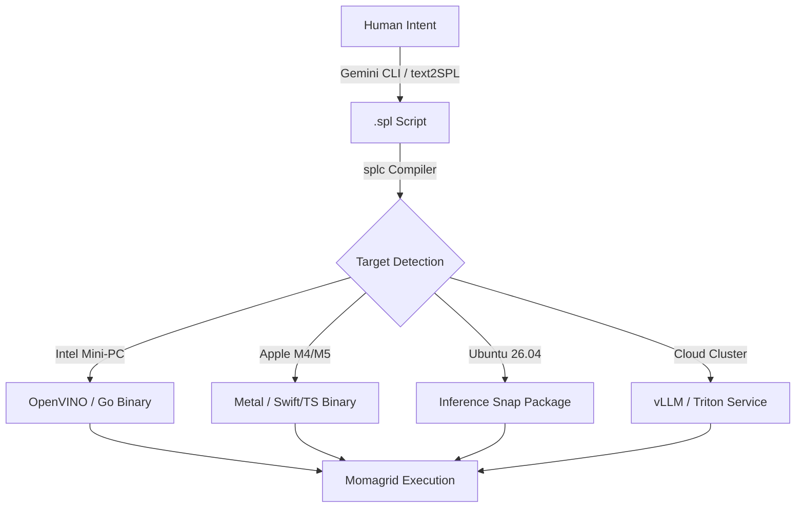

The synergy between your discovery of high-performance CPU inference on Intel Mini-PCs and the recent breakthroughs in **Gemma 4** and **Liquid AI LFM-2** provides a perfect empirical foundation for **SPL v3.0**. 

The **DODA (Design Once, Deploy Anywhere)** paradigm, paired with **Ubuntu 26.04’s Inference Snaps**, represents the "Java Moment" for AI: a unified, architecture-aware deployment layer that treats model weights and declarative logic as a single, portable artifact.

Below are the two requested documents.

---

### **(1) SPL v3.0 arxiv paper.md**

```markdown
# SPL v3.0: A Unified Declarative Framework for Multi-Modal AI Deployment and Cross-Language Compilation

**Author:** Wen G. Gong  
**Date:** April 2026  
**Status:** Preprint Submission (ArXiv:2604.XXXXX)

## Abstract
We present SPL v3.0, the "Forest" evolution of the Structured Prompt Language. Following the context-management focus of v1.0 and the orchestration focus of v2.0, v3.0 introduces the **DODA (Design Once, Deploy Anywhere)** paradigm. This version addresses the "deployment gap" between high-end GPU clusters and commodity enterprise hardware. We introduce the `splc` compiler, which transforms declarative .spl scripts into optimized bytecode and native source code (Go, TypeScript, Python) for heterogeneous runtimes. Leveraging the sparse architecture of Liquid AI LFM-2 and the native multi-modality of Gemma 4, we demonstrate that a distributed "Momagrid" composed of Intel-based Mini-PCs and Apple Silicon (M4/M5) can achieve production-grade batch inference throughput at zero marginal token cost.

## 1. Introduction: The DODA Paradigm
- The "Java Moment" for AI: Moving from provider-specific SDKs to an Intermediate Representation (IR).
- Convergence: The simultaneous release of Gemma 4, LFM-2, and Ubuntu 26.04 "Resolute Raccoon."
- Vision: Democratizing the "Forest" by harvesting idle compute from thousand-node enterprise fleets.

## 2. Multi-Modal Declarative Primitives
- **Unified Media Selection:** Extending `SELECT` to handle `audio`, `vision`, and `video` natively.
- **MMU (Multi-Modal Units):** Formalizing cross-modality token budgeting in `WITH BUDGET`.
- **Gemma 4 Native Integration:** Utilizing the E2B/E4B "Thinking Modes" for complex branching logic.

## 3. System Architecture: The splc Compiler
- **text2SPL (Semantic Layer):** Transforming fluid human intent into rigid, auditable SPL contracts.
- **splc (Structural Layer):** Hardware-aware targeting (OpenVINO for Intel, Metal for Apple, CUDA for NVIDIA).
- **Snap Inference:** Leveraging Ubuntu 26.04's immutable `inference-snap` for one-click deployment.

## 4. Evaluation: The Resolute Convergence
- **The Mini-PC Breakthrough:** Benchmarking Liquid AI LFM-2 (2.6B) and Gemma 4 (E4B) on Intel CPU/iGPU.
- **DODA Portability:** Running the identical `.spl` script across a 10-node grid of mixed Win11/Ubuntu/macOS hardware.
- **Cost Analysis:** Comparing "Computational Harvesting" on Momagrid vs. AWS Bedrock and OpenAI.

## Appendix: Research & Implementation Todo List
- [ ] **Grammar:** Update EBNF to support `audio.transcribe` and `vision.analyze` methods.
- [ ] **Implementation:** Prototype the `splc --target go` backend for high-concurrency banking services.
- [ ] **Benchmarking:** Measure "Tokens per Watt" on the Intel Mini-PC running LFM-2 (Expected: 3x efficiency vs standard Transformers).
- [ ] **Documentation:** Prepare a "DODA Migration Guide" for enterprise AI teams.
```

---

### **(2) SPL v3.0 spec.md**

```markdown
# SPL v3.0 Specification: DODA & Multi-Modal Orchestration

## 1. Multi-Modality Definition
SPL v3.0 promotes non-text modalities to first-class citizens. Data sources are referenced via the `@` symbol and processed via modality-specific methods.

### 1.1 Grammar Extensions
```sql
-- Method: audio.listen() or audio.transcribe()
-- Method: vision.analyze() or vision.ocr()
-- Method: video.track() or video.summarize()
```

### 1.2 Multi-Modal Budgeting (MMU)
The `WITH BUDGET` clause now accepts a total token count that the `Optimizer` distributes across media encoders:
- **Audio:** ~300M parameter encoders (Gemma 4 E2B/E4B).
- **Vision:** ~150M parameter encoders (Gemma 4 E2B/E4B).

## 2. DODA: Design Once, Deploy Anywhere
The **DODA** philosophy ensures that the logic in a `.spl` file remains invariant while the physical implementation adapts to the node's silicon.

### 2.1 The splc Compiler (The "Java-like" Moment)
The `splc` compiler acts as the Bridge between high-level logic and native machine execution.



## 3. Multi-Runtime & Heterogeneous Device Support

### 3.1 Device Tiers
| Tier | Device Class | Runtime Profile | Recommended Model |
| :--- | :--- | :--- | :--- |
| **Logic** | Mac Mini M4/M5 | Unified Memory / Metal | Gemma 4 31B / LFM-2 24B |
| **Batch** | Intel Mini-PC | CPU/iGPU / OpenVINO | Gemma 4 E4B / LFM-2 2.6B |
| **Edge** | Mobile / IoT | ARM / Android AICore | Gemma 4 E2B (Fast) |

### 3.2 Dynamic Fallback (The Resolute Path)
The `splc` runtime detects hardware failure or resource exhaustion and migrates execution:
1. **Local High-Density:** Utilize all CPU cores (Intel Mini-PC).
2. **Local Sparse:** Shift to Liquid LFM-2 if memory is <4GB.
3. **Cloud Failover:** Fallback to AWS Bedrock if local nodes are offline.

## 4. Snap Inference (Canonical Integration)
For Ubuntu 26.04, `splc` outputs a `.snap` file that encapsulates:
- The compiled SPL logic (in Go/C++).
- The quantized weights for the target model.
- The `inference-snap` interface to link directly with host GPU/NPU drivers.
```

---

### **Strategy Note for your Mini-PC Build**
Since you are currently using the Intel Mini-PC with **Ubuntu 24.04**, you are in the perfect position to "pre-flight" the **DODA** vision before the 26.04 release. 

**Your First Learning/Dev Milestone:**
Use the **Gemini CLI** to generate an SPL v3.0 script that specifically uses the **Liquid AI LFM-2** for text reasoning and **Gemma 4 E2B** for audio transcription on the same mini-PC. This "heterogeneous model" approach is the core of the **MOMA** (Mixture of Model on Ollama) logic you've pioneered.

**Would you like me to generate the first `GEMINI.md` for your `SPL30` codebase to ground the CLI in this DODA vision?**