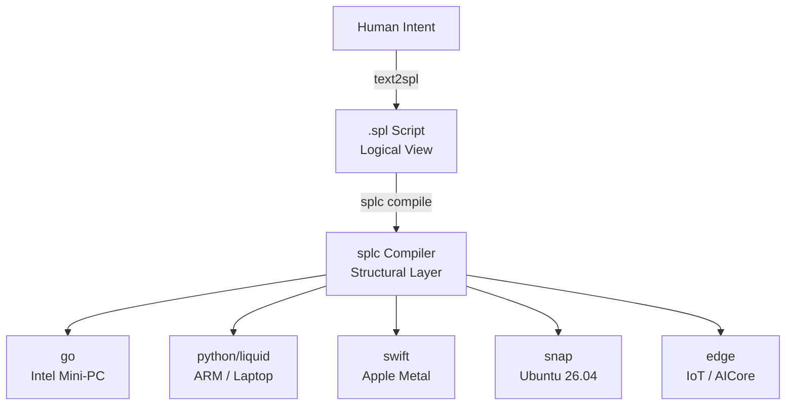

# TikZ Graphics for SPL 3.0

*TikZ tutorial + ready-to-compile diagrams for the SPL 3.0 paper.*

---

## Part 1 — What is TikZ?

TikZ ("TikZ ist kein Zeichenprogramm" — TikZ is not a drawing program) is the
standard LaTeX package for vector diagrams. You describe the diagram in code;
LaTeX compiles it into crisp PDF vector graphics.

**Key difference from Mermaid:**

| | Mermaid | TikZ |
|---|---|---|
| Where it works | `.md` files, GitHub, browser | `.tex` files, PDF compilation |
| Renderer | JavaScript (browser) | pdflatex / xelatex / lualatex |
| Output | PNG / SVG rendered on screen | Vector PDF (print-quality) |
| arXiv / journal papers | ✗ not accepted | ✓ standard |
| GitHub README | ✓ renders automatically | ✗ shows raw code |
| Control | Low (opinionated layout) | High (pixel-perfect) |

**Rule of thumb:**
- ROADMAP.md, README → Mermaid
- arXiv paper, SPEC.md, formal diagrams → TikZ

---

## Part 2 — Setup

### Option A: Overleaf (easiest — no local install)

1. Go to [overleaf.com](https://www.overleaf.com), create a free account.
2. New Project → Blank Project.
3. Paste the examples below, click Compile.
4. TikZ is pre-installed on Overleaf — no setup needed.

### Option B: Local LaTeX

```bash
# Ubuntu / Debian
sudo apt install texlive-full          # all packages including TikZ

# macOS
brew install --cask mactex             # full MacTeX distribution

# Compile
pdflatex my_diagram.tex                # → my_diagram.pdf
```

### Minimal document skeleton

Every TikZ diagram lives inside this skeleton:

```latex
\documentclass{article}
\usepackage{tikz}
\usetikzlibrary{arrows.meta, positioning, shapes.geometric, fit, backgrounds}

\begin{document}
\begin{figure}[h]
  \centering
  \begin{tikzpicture}
    % --- your diagram code goes here ---
  \end{tikzpicture}
  \caption{My diagram}
  \label{fig:my-diagram}
\end{figure}
\end{document}
```

---

## Part 3 — Core Concepts (Tutorial)

### 3.1 Nodes — the building blocks

A **node** is a labelled box (or circle, or bare point).

```latex
\begin{tikzpicture}
  \node (A) {Hello};          % bare label at origin
  \node[draw] (B) at (3,0) {World};   % boxed node at coordinate (3,0)
\end{tikzpicture}
```

Key node options:

| Option | Effect |
|---|---|
| `draw` | draws the border |
| `fill=blue!20` | fills with 20% blue |
| `rounded corners` | rounded rectangle |
| `circle` | circular shape |
| `diamond` | decision diamond |
| `minimum width=3cm` | sets minimum width |
| `minimum height=0.8cm` | sets minimum height |
| `text centered` | centers multi-line text |
| `font=\small` | font size |

```latex
\begin{tikzpicture}
  \node[draw, fill=blue!15, rounded corners, minimum width=2.5cm]
    (box) {A rounded box};

  \node[draw, circle, fill=orange!30, right=2cm of box]
    (circle) {circle};

  \node[draw, diamond, aspect=2, fill=yellow!30, below=1.5cm of box]
    (decision) {decision?};
\end{tikzpicture}
```

### 3.2 Relative positioning (the `positioning` library)

Always load `\usetikzlibrary{positioning}` — it gives you `right=of`, `below=of`, etc.

```latex
% Set default spacing between nodes
\begin{tikzpicture}[node distance=1.2cm and 2cm]
  %                              ↑ vertical  ↑ horizontal

  \node[draw] (A) {Start};
  \node[draw, right=of A] (B) {Middle};     % 2cm to the right
  \node[draw, right=of B] (C) {End};        % another 2cm right
  \node[draw, below=of B] (D) {Below B};    % 1.2cm below B
\end{tikzpicture}
```

Fine-tune spacing inline:

```latex
\node[draw, right=3cm of A]  (B) {far right};
\node[draw, below=0.5cm of A] (C) {close below};
\node[draw, below right=1cm and 2cm of A] (D) {diagonal};
```

### 3.3 Edges and arrows

```latex
\begin{tikzpicture}
  \node[draw] (A) {A};
  \node[draw, right=2cm of A] (B) {B};
  \node[draw, right=2cm of B] (C) {C};

  \draw[->]          (A) -- (B);    % simple arrow
  \draw[->, thick]   (B) -- (C);    % thick arrow
  \draw[<->]         (A) to[bend left=20] (C);   % curved double arrow
\end{tikzpicture}
```

**Arrow tip styles** (requires `arrows.meta`):

```latex
\draw[->, >=Stealth]  (A) -- (B);   % filled triangle (most common in papers)
\draw[->, >=Latex]    (A) -- (B);   % LaTeX-style arrow
\draw[->, >=open triangle 45] (A) -- (B);  % open triangle
```

**Labels on edges:**

```latex
\draw[->] (A) -- node[above] {compile} (B);          % label above the edge
\draw[->] (A) -- node[below, font=\small] {step 1} (B);  % label below
\draw[->] (A) -- node[midway, right] {side} (B);     % midpoint, right side
```

**Dashed / dotted / colored:**

```latex
\draw[->, dashed]               (A) -- (B);   % dashed
\draw[->, dotted, thick]        (A) -- (B);   % dotted thick
\draw[->, color=red!70!black]   (A) -- (B);   % dark red
\draw[->, draw=blue, very thick](A) -- (B);   % blue thick
```

### 3.4 Styles — DRY principle

Define reusable styles in the `tikzpicture` options to avoid repetition:

```latex
\begin{tikzpicture}[
  % named styles
  box/.style  = {draw, rounded corners=3pt, minimum width=2.5cm,
                 minimum height=0.7cm, text centered, font=\small},
  cloud/.style= {box, fill=blue!10},
  local/.style= {box, fill=green!15},
  arrow/.style= {->, >=Stealth, thick},
  label/.style= {font=\scriptsize\itshape, text=gray!80},
  %
  node distance = 1.2cm and 2.5cm
]
  \node[cloud]  (intent) {Human Intent};
  \node[local, below=of intent] (spl) {.spl Script};
  \draw[arrow] (intent) -- node[label, right] {text2spl} (spl);
\end{tikzpicture}
```

### 3.5 Colors

TikZ uses the `xcolor` package (loaded automatically). Common patterns:

```latex
fill=blue!20          % 20% blue, 80% white
fill=red!40!white     % 40% red mixed with white
fill=green!30!black   % 30% green mixed with black
draw=gray!60          % 60% gray border
text=white            % white text
```

Custom colors:

```latex
\definecolor{spl-blue}{RGB}{41, 98, 255}
\definecolor{spl-green}{RGB}{30, 150, 80}
\node[fill=spl-blue, text=white] (A) {SPL};
```

### 3.6 Fitting a box around other nodes

Use the `fit` library to draw a bounding box around a group:

```latex
\usetikzlibrary{fit, backgrounds}

\begin{tikzpicture}
  \node[draw] (A) {Node A};
  \node[draw, right=of A] (B) {Node B};

  % Draw a dashed box around both
  \begin{scope}[on background layer]
    \node[draw, dashed, rounded corners, fill=yellow!10,
          fit=(A)(B), inner sep=0.4cm, label=above:Group] {};
  \end{scope}
\end{tikzpicture}
```

---

## Part 4 — SPL 3.0 Diagrams

Copy any diagram into the minimal document skeleton from §2 and compile.

---

### Diagram 1: DODA Pipeline (full architecture)

The main SPL 3.0 architecture — Human Intent → text2spl → .spl → splc → targets.

```latex
\documentclass{article}
\usepackage{tikz}
\usetikzlibrary{arrows.meta, positioning, fit, backgrounds}
\usepackage{xcolor}

\begin{document}
\begin{figure}[h]
\centering
\begin{tikzpicture}[
  box/.style    = {draw, rounded corners=4pt, minimum width=3.2cm,
                   minimum height=0.75cm, text centered, font=\small},
  target/.style = {draw, rounded corners=3pt, minimum width=2.6cm,
                   minimum height=0.65cm, text centered,
                   font=\small\ttfamily, fill=blue!8},
  arrow/.style  = {->, >=Stealth, thick},
  lbl/.style    = {font=\scriptsize\itshape, text=gray!70},
  node distance = 1.3cm and 1.6cm
]

%% ── Vertical spine ───────────────────────────────────────────────
\node[box, fill=yellow!25]     (intent) {Human Intent};
\node[box, fill=green!15,
      below=of intent]         (spl)    {.spl Script \\ \scriptsize(Logical View)};
\node[box, fill=orange!20,
      below=of spl]            (splc)   {splc Compiler \\ \scriptsize(Structural Layer)};

%% ── Five compile targets ─────────────────────────────────────────
\node[target, below left = 1.8cm and 3.8cm of splc]  (go)     {go \\ \scriptsize Intel Mini-PC};
\node[target, below left = 1.8cm and 1.2cm of splc]  (liquid) {python/liquid \\ \scriptsize ARM / Laptop};
\node[target, below       = 1.8cm             of splc](swift)  {swift \\ \scriptsize Apple Metal};
\node[target, below right = 1.8cm and 1.2cm of splc] (snap)   {snap \\ \scriptsize Ubuntu 26.04};
\node[target, below right = 1.8cm and 3.8cm of splc] (edge)   {edge \\ \scriptsize IoT / AICore};

%% ── Momagrid execution band ──────────────────────────────────────
\begin{scope}[on background layer]
  \node[draw=gray!50, dashed, rounded corners=6pt, fill=gray!5,
        fit=(go)(liquid)(swift)(snap)(edge),
        inner sep=0.35cm,
        label={[font=\scriptsize\itshape, text=gray]below:Momagrid Execution}] {};
\end{scope}

%% ── Arrows: spine ────────────────────────────────────────────────
\draw[arrow] (intent) -- node[lbl, right] {text2spl (semantic)} (spl);
\draw[arrow] (spl)    -- node[lbl, right] {splc compile}         (splc);

%% ── Arrows: fan-out to targets ───────────────────────────────────
\foreach \t in {go, liquid, swift, snap, edge}
  \draw[arrow] (splc) -- (\t);

%% ── Side annotations ─────────────────────────────────────────────
\node[lbl, right=0.25cm of intent] {NL description};
\node[lbl, right=0.25cm of spl]    {hardware-agnostic IR};
\node[lbl, right=0.25cm of splc]   {target-aware optimizer};

\end{tikzpicture}
\caption{SPL 3.0 DODA (Design Once, Deploy Anywhere) architecture.
         The \texttt{.spl} logical view is the invariant IR;
         \texttt{splc} produces hardware-specific artifacts per target.}
\label{fig:doda-pipeline}
\end{figure}
\end{document}
```

**Mermaid equivalent** (for README):


---

### Diagram 2: Two-Layer Separation

Clean separation of semantic vs structural layer — useful for paper introduction.

```latex
\documentclass{article}
\usepackage{tikz}
\usetikzlibrary{arrows.meta, positioning}

\begin{document}
\begin{figure}[h]
\centering
\begin{tikzpicture}[
  layer/.style  = {draw, rounded corners=5pt, minimum width=3.8cm,
                   minimum height=1cm, text centered, font=\small\bfseries},
  arrow/.style  = {->, >=Stealth, thick},
  lbl/.style    = {font=\scriptsize\itshape, text=gray!70},
  node distance = 0.9cm and 3cm
]

\node[layer, fill=green!15]  (t2s)  {text2spl \\ \scriptsize\normalfont Semantic Layer};
\node[layer, fill=blue!8,
      right=of t2s]          (ir)   {.spl \\ \scriptsize\normalfont Logical IR};
\node[layer, fill=orange!18,
      right=of ir]           (splc) {splc \\ \scriptsize\normalfont Structural Layer};
\node[layer, fill=gray!12,
      right=of splc]         (dep)  {Deployment \\ \scriptsize\normalfont Physical Artifact};

\draw[arrow] (t2s)  -- node[lbl,above] {NL → SPL} (ir);
\draw[arrow] (ir)   -- node[lbl,above] {IR}         (splc);
\draw[arrow] (splc) -- node[lbl,above] {target}     (dep);

\node[lbl, below=0.15cm of t2s]  {LLM-assisted};
\node[lbl, below=0.15cm of ir]   {invariant};
\node[lbl, below=0.15cm of splc] {hardware-aware};
\node[lbl, below=0.15cm of dep]  {go / python / swift};

\end{tikzpicture}
\caption{SPL 3.0 two-layer pipeline. \emph{text2spl} translates
         natural language into a hardware-agnostic \texttt{.spl} intermediate
         representation; \emph{splc} compiles it to deployment-specific artifacts.}
\label{fig:two-layer}
\end{figure}
\end{document}
```

---

### Diagram 3: Multi-Modal ContentPart Type Hierarchy

The `ContentPart` union and `MultiModalMixin` adapter architecture.

```latex
\documentclass{article}
\usepackage{tikz}
\usetikzlibrary{arrows.meta, positioning}

\begin{document}
\begin{figure}[h]
\centering
\begin{tikzpicture}[
  cls/.style    = {draw, rounded corners=3pt, minimum width=3.2cm,
                   minimum height=0.7cm, text centered, font=\small\ttfamily},
  abs/.style    = {cls, fill=gray!12, font=\small\ttfamily\itshape},
  part/.style   = {cls, fill=blue!10},
  adapt/.style  = {cls, fill=orange!15},
  impl/.style   = {cls, fill=green!12},
  inh/.style    = {->, >=open triangle 60, thick},   % inheritance arrow
  comp/.style   = {->, >=Stealth, dashed, thick},    % composition arrow
  lbl/.style    = {font=\scriptsize\itshape, text=gray!70},
  node distance = 0.9cm and 1.6cm
]

%% ── ContentPart union (left column) ──────────────────────────────
\node[abs]  (cp)    {ContentPart};
\node[part, below left  = 1cm and 1.8cm of cp] (tp) {TextPart};
\node[part, below left  = 1cm and 0.2cm of cp] (ip) {ImagePart};
\node[part, below right = 1cm and 0.2cm of cp] (ap) {AudioPart};
\node[part, below right = 1cm and 1.8cm of cp] (vp) {VideoPart};

\foreach \child in {tp, ip, ap, vp}
  \draw[inh] (\child) -- (cp);

%% ── Adapter hierarchy (right column) ─────────────────────────────
\node[abs,  right=5.5cm of cp]               (llm)  {LLMAdapter};
\node[adapt,below left  = 1cm and 1cm of llm](mmix) {MultiModalMixin};
\node[adapt,below right = 1cm and 0.2cm of llm](mma) {MultiModalAdapter};
\node[impl, below left  = 1cm and 0.3cm of mma](liq) {LiquidAdapter};
\node[impl, below right = 1cm and 0.3cm of mma](snp) {SnapAdapter \\ \scriptsize[placeholder]};

\draw[inh]  (mmix) -- (llm);
\draw[inh]  (mma)  -- (llm);
\draw[inh]  (mma)  -- (mmix);
\draw[inh]  (liq)  -- (mma);
\draw[inh]  (snp)  -- (mma);

%% ── generate_multimodal takes list[ContentPart] ──────────────────
\draw[comp] (cp) to[bend left=10]
  node[lbl, above] {list[ContentPart]} (mmix);

%% ── Codec annotations ────────────────────────────────────────────
\node[lbl, below=0.1cm of tp] {text};
\node[lbl, below=0.1cm of ip] {base64 | url};
\node[lbl, below=0.1cm of ap] {base64};
\node[lbl, below=0.1cm of vp] {frames[ ]};

\node[lbl, below=0.1cm of liq] {Ollama | OpenRouter};
\node[lbl, below=0.1cm of snp] {Ubuntu 26.04};

\end{tikzpicture}
\caption{SPL 3.0 multi-modal type system (left) and adapter class hierarchy (right).
         \texttt{ContentPart} is a union of four TypedDicts;
         \texttt{MultiModalMixin} adds \texttt{generate\_multimodal()} to any adapter.}
\label{fig:multimodal-arch}
\end{figure}
\end{document}
```

---

### Diagram 4: Voice Dialogue Pipeline (Recipe 55)

The AUDIO+TEXT → TEXT+AUDIO recipe as a data-flow diagram.

```latex
\documentclass{article}
\usepackage{tikz}
\usetikzlibrary{arrows.meta, positioning, shapes.geometric}

\begin{document}
\begin{figure}[h]
\centering
\begin{tikzpicture}[
  io/.style     = {draw, ellipse, minimum width=2.2cm, minimum height=0.7cm,
                   text centered, font=\small, fill=yellow!20},
  step/.style   = {draw, rounded corners=4pt, minimum width=3cm,
                   minimum height=0.8cm, text centered, font=\small,
                   fill=blue!10},
  model/.style  = {font=\scriptsize\itshape, text=gray!70},
  arrow/.style  = {->, >=Stealth, thick},
  data/.style   = {font=\scriptsize, text=black!70},
  node distance = 0.5cm and 0cm
]

%% ── Data nodes (ovals) ───────────────────────────────────────────
\node[io]           (audio-in)   {Audio in \\ \scriptsize(.wav / .mp3)};
\node[step, right=2cm of audio-in] (asr)  {ASR \\ \scriptsize LFM-2.5};
\node[io,   right=2cm of asr]    (trans)  {Transcript \\ \scriptsize(TEXT)};
\node[step, right=2cm of trans]  (llm)    {LLM \\ \scriptsize Gemma4};
\node[io,   right=2cm of llm]    (resp)   {Response \\ \scriptsize(TEXT)};

%% ── Second row: TTS ──────────────────────────────────────────────
\node[step, below=1.8cm of resp] (tts)    {TTS \\ \scriptsize OpenAI / espeak};
\node[io,   left=2cm of tts]     (audio-out) {Audio out \\ \scriptsize(.mp3 / .wav)};

%% ── Horizontal arrows (top row) ──────────────────────────────────
\draw[arrow] (audio-in) -- node[data, above] {encode\_audio()} (asr);
\draw[arrow] (asr)      -- node[data, above] {transcribe}       (trans);
\draw[arrow] (trans)    -- node[data, above] {prompt}           (llm);
\draw[arrow] (llm)      -- node[data, above] {generate()}       (resp);

%% ── Down and left (TTS row) ──────────────────────────────────────
\draw[arrow] (resp)     -- node[data, right] {text}         (tts);
\draw[arrow] (tts)      -- node[data, above] {synthesise()} (audio-out);

%% ── Context input (enters from top into LLM) ─────────────────────
\node[io, above=1.2cm of llm] (ctx) {Context \\ \scriptsize(TEXT, optional)};
\draw[arrow, dashed] (ctx) -- (llm);

%% ── Backend labels ───────────────────────────────────────────────
\node[model, below=0.1cm of asr]       {OpenRouter};
\node[model, below=0.1cm of llm]       {Ollama};
\node[model, below=0.1cm of tts]       {OpenAI TTS};

\end{tikzpicture}
\caption{Recipe 55 Voice Dialogue: full AUDIO+TEXT $\to$ TEXT+AUDIO pipeline.
         Three models collaborate — LFM-2.5 (ASR), Gemma4 (LLM), OpenAI TTS.}
\label{fig:voice-dialogue}
\end{figure}
\end{document}
```

---

### Diagram 5: Momagrid Hub-and-Spoke

The compute OS analogy — Hub as kernel, workflows as processes.

```latex
\documentclass{article}
\usepackage{tikz}
\usetikzlibrary{arrows.meta, positioning, shapes.geometric, fit, backgrounds}

\begin{document}
\begin{figure}[h]
\centering
\begin{tikzpicture}[
  hub/.style    = {draw, circle, minimum size=1.8cm, text centered,
                   font=\small\bfseries, fill=orange!25, thick},
  agent/.style  = {draw, rounded corners=3pt, minimum width=1.8cm,
                   minimum height=0.65cm, text centered, font=\small,
                   fill=blue!10},
  client/.style = {draw, rounded corners=3pt, minimum width=1.8cm,
                   minimum height=0.65cm, text centered, font=\small,
                   fill=green!10},
  peering/.style= {<->, >=Stealth, thick, dashed, gray!60},
  task/.style   = {->, >=Stealth, thick},
  lbl/.style    = {font=\scriptsize\itshape, text=gray!70},
  node distance = 1.4cm and 2cm
]

%% ── LAN Hub (duck) ───────────────────────────────────────────────
\node[hub] (hub-lan) {LAN Hub \\ \scriptsize duck};

\node[agent, above left  = 1.2cm and 1.5cm of hub-lan] (duck) {duck \\ \scriptsize GTX 1080Ti};
\node[agent, above right = 1.2cm and 1.5cm of hub-lan] (cat)  {cat  \\ \scriptsize GTX 1080Ti};
\node[agent, below left  = 1.2cm and 1.5cm of hub-lan] (dog)  {dog  \\ \scriptsize GTX 1080Ti};
\node[agent, below right = 1.2cm and 1.5cm of hub-lan] (goose){goose\\ \scriptsize RTX 4060};

\foreach \a in {duck, cat, dog, goose}
  \draw[task] (hub-lan) -- (\a);

%% ── Cloud Hub (Oracle) ───────────────────────────────────────────
\node[hub, right=5cm of hub-lan] (hub-cloud) {Cloud Hub \\ \scriptsize Oracle};

\node[agent, above=1.2cm of hub-cloud] (vm1) {free-tier VM};
\node[agent, below=1.2cm of hub-cloud] (vm2) {free-tier VM};

\draw[task] (hub-cloud) -- (vm1);
\draw[task] (hub-cloud) -- (vm2);

%% ── Hub-to-Hub peering ───────────────────────────────────────────
\draw[peering] (hub-lan) -- node[lbl, above] {peer (WAN)} (hub-cloud);

%% ── Client submitter ─────────────────────────────────────────────
\node[client, above=2cm of hub-lan] (client) {Laptop client};
\draw[->, >=Stealth, thick] (client)
  -- node[lbl, left] {POST /tasks} (hub-lan);

%% ── Bounding boxes ───────────────────────────────────────────────
\begin{scope}[on background layer]
  \node[draw=blue!40, dashed, rounded corners=8pt, fill=blue!4,
        fit=(hub-lan)(duck)(cat)(dog)(goose),
        inner sep=0.5cm,
        label={[font=\scriptsize\itshape]below:LAN cluster}] {};
  \node[draw=orange!40, dashed, rounded corners=8pt, fill=orange!4,
        fit=(hub-cloud)(vm1)(vm2),
        inner sep=0.5cm,
        label={[font=\scriptsize\itshape]below:Oracle Cloud}] {};
\end{scope}

\end{tikzpicture}
\caption{Momagrid Hub-and-spoke topology. Each Hub manages its own GPU cluster
         (an autonomous compute domain). Hub-to-Hub peering over WAN enables
         cross-cluster workflow dispatch without protocol changes.}
\label{fig:momagrid}
\end{figure}
\end{document}
```

---

### Diagram 6: SPL Type System (v2.0 → v3.0)

Shows which types are new in SPL 3.0 vs inherited from 2.0.

```latex
\documentclass{article}
\usepackage{tikz}
\usetikzlibrary{arrows.meta, positioning, fit, backgrounds}

\begin{document}
\begin{figure}[h]
\centering
\begin{tikzpicture}[
  t2/.style = {draw, rounded corners=3pt, minimum width=2cm,
               minimum height=0.6cm, text centered,
               font=\small\ttfamily, fill=gray!12},
  t3/.style = {draw, rounded corners=3pt, minimum width=2cm,
               minimum height=0.6cm, text centered,
               font=\small\ttfamily, fill=blue!15},
  mm/.style = {draw, rounded corners=3pt, minimum width=2cm,
               minimum height=0.6cm, text centered,
               font=\small\ttfamily, fill=green!18},
  node distance = 0.5cm and 0.6cm
]

%% ── Row 1: scalar ────────────────────────────────────────────────
\node[t2] (TEXT)   {TEXT};
\node[t2, right=of TEXT]   (NUM)  {NUMBER};
\node[t2, right=of NUM]    (BOOL) {BOOL};
\node[t3, right=of BOOL]   (INT)  {INT};
\node[t3, right=of INT]    (FLT)  {FLOAT};
\node[t3, right=of FLT]    (NONE) {NONE / NULL};

%% ── Row 2: collection ────────────────────────────────────────────
\node[t2, below=0.9cm of TEXT]  (LIST) {LIST};
\node[t2, right=of LIST]        (MAP)  {MAP};
\node[t3, right=of MAP]         (SET)  {SET};
\node[t2, right=of SET]         (STOR) {STORAGE};

%% ── Row 3: multimodal ────────────────────────────────────────────
\node[mm, below=0.9cm of LIST]  (IMG)  {IMAGE};
\node[mm, right=of IMG]         (AUD)  {AUDIO};
\node[mm, right=of AUD]         (VID)  {VIDEO};

%% ── Row 4: future ────────────────────────────────────────────────
\node[draw, rounded corners=3pt, minimum width=2cm, minimum height=0.6cm,
      text centered, font=\small\ttfamily, fill=yellow!20, dashed,
      right=of VID] (DC) {DATACLASS \\ \scriptsize v3.1};

%% ── Legend ───────────────────────────────────────────────────────
\node[t2, below=1.5cm of IMG,  label=right:{\small SPL 2.0 (unchanged)}] (leg1) {};
\node[t3, right=2cm of leg1,   label=right:{\small SPL 3.0 new}] (leg2) {};
\node[mm, right=2cm of leg2,   label=right:{\small SPL 3.0 multimodal}] (leg3) {};

%% ── Bounding boxes ───────────────────────────────────────────────
\begin{scope}[on background layer]
  \node[draw=gray!40, dashed, rounded corners=5pt, fill=gray!3,
        fit=(TEXT)(NUM)(BOOL)(INT)(FLT)(NONE),
        inner sep=0.25cm,
        label={[font=\scriptsize\itshape]left:scalar}] {};
  \node[draw=gray!40, dashed, rounded corners=5pt, fill=gray!3,
        fit=(LIST)(MAP)(SET)(STOR),
        inner sep=0.25cm,
        label={[font=\scriptsize\itshape]left:collection}] {};
  \node[draw=green!40, dashed, rounded corners=5pt, fill=green!3,
        fit=(IMG)(AUD)(VID),
        inner sep=0.25cm,
        label={[font=\scriptsize\itshape]left:multimodal}] {};
\end{scope}

\end{tikzpicture}
\caption{SPL type system evolution. Gray = SPL 2.0 unchanged; blue = new in SPL 3.0;
         green = multimodal types (IMAGE, AUDIO, VIDEO); yellow dashed = v3.1 planned.}
\label{fig:type-system}
\end{figure}
\end{document}
```

---

## Part 5 — Mermaid ↔ TikZ Equivalence

| Concept | Mermaid | TikZ |
|---|---|---|
| Box node | `A[Label]` | `\node[draw] (A) {Label};` |
| Rounded box | `A(Label)` | `\node[draw, rounded corners] (A) {Label};` |
| Diamond | `A{Label}` | `\node[draw, diamond, aspect=2] (A) {Label};` |
| Circle | `A((Label))` | `\node[draw, circle] (A) {Label};` |
| Arrow | `A --> B` | `\draw[->] (A) -- (B);` |
| Labelled arrow | `A -->|text| B` | `\draw[->] (A) -- node[above] {text} (B);` |
| Dashed arrow | `A -.-> B` | `\draw[->, dashed] (A) -- (B);` |
| Subgraph | `subgraph Name` | `\node[fit=..., draw] {};` (with `fit` library) |
| Left-to-right | `graph LR` | `node distance = ... and ...` (horizontal spacing larger) |
| Top-to-bottom | `graph TD` | default vertical `node distance` |
| Color fill | `style fill:#bbf` | `fill=blue!20` |

---

## Part 6 — Quick Reference Card

```latex
%% ── Preamble ─────────────────────────────────────────────────────────────────
\usepackage{tikz}
\usetikzlibrary{arrows.meta, positioning, shapes.geometric, fit, backgrounds}

%% ── Node shapes ──────────────────────────────────────────────────────────────
\node[draw]                    % rectangle
\node[draw, rounded corners]   % rounded rectangle
\node[draw, circle]            % circle
\node[draw, ellipse]           % ellipse
\node[draw, diamond, aspect=2] % decision diamond

%% ── Common node options ──────────────────────────────────────────────────────
minimum width=3cm, minimum height=0.8cm
text centered
font=\small          % \tiny \scriptsize \footnotesize \small \normalsize \large
fill=blue!20         % color!percentage
draw=red!60
text=white
inner sep=0.3cm      % padding inside node
rounded corners=5pt  % radius

%% ── Arrows ───────────────────────────────────────────────────────────────────
\draw[->]                (A) -- (B);   % basic arrow
\draw[->, >=Stealth]     (A) -- (B);   % filled triangle (preferred in papers)
\draw[->, thick]         (A) -- (B);   % thick
\draw[->, dashed]        (A) -- (B);   % dashed
\draw[<->]               (A) -- (B);   % double-headed
\draw[->] (A) to[bend left=20] (B);    % curved
\draw[->] (A) |- (B);                  % right-angle: horizontal then vertical
\draw[->] (A) -| (B);                  % right-angle: vertical then horizontal

%% ── Edge labels ──────────────────────────────────────────────────────────────
\draw[->] (A) -- node[above] {text} (B);
\draw[->] (A) -- node[below, font=\small] {text} (B);
\draw[->] (A) -- node[midway, sloped, above] {text} (B);  % follows edge angle

%% ── Positioning ──────────────────────────────────────────────────────────────
[node distance = 1.2cm and 2cm]    % vertical and horizontal defaults
\node[..., right=of A]  (B) {};    % default horizontal distance
\node[..., right=3cm of A] (B) {}; % explicit distance
\node[..., below right=1cm and 2cm of A] (B) {};   % diagonal

%% ── Fit box around nodes ─────────────────────────────────────────────────────
\begin{scope}[on background layer]
  \node[draw, dashed, fit=(A)(B)(C), inner sep=0.4cm, label=above:Group] {};
\end{scope}

%% ── foreach loop ─────────────────────────────────────────────────────────────
\foreach \n in {A, B, C}
  \draw[->] (hub) -- (\n);

%% ── Colors ───────────────────────────────────────────────────────────────────
% Mixing:   red!30, blue!20!white, green!40!black
% Named:    red orange yellow green blue violet purple gray black white
% Custom:   \definecolor{myblue}{RGB}{30, 100, 200}
```

---

## Part 7 — Compiling for arXiv

arXiv accepts `.tex` source with TikZ. Requirements:

```
project/
  main.tex          ← \usepackage{tikz} in preamble
  figures/
    doda.tex        ← standalone diagrams (optional)
  main.bib
```

**Standalone diagram file** (compile separately, then `\input`):

```latex
% figures/doda.tex
\begin{tikzpicture}
  % ... diagram code ...
\end{tikzpicture}
```

```latex
% main.tex
\begin{figure}[h]
  \centering
  \input{figures/doda}
  \caption{DODA pipeline.}
  \label{fig:doda}
\end{figure}
```

This keeps `main.tex` clean and lets you iterate on diagrams independently.

**arXiv submission checklist:**
- `\usepackage{tikz}` and all `\usetikzlibrary{...}` are in the preamble
- No external image files needed — TikZ is self-contained in the `.tex`
- Test with `pdflatex main.tex` locally before uploading
- arXiv runs `pdflatex` by default; switch to `xelatex` in `latexmkrc` if needed
