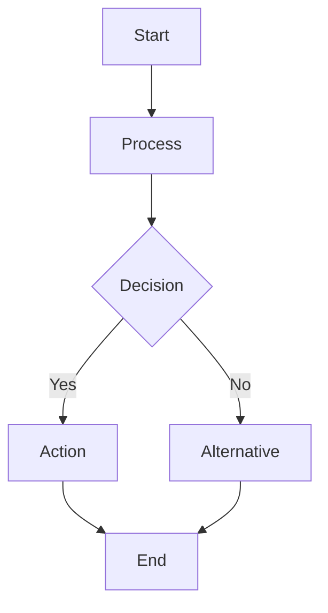

# Text2Mermaid2SPL: Visual Workflow Programming Pipeline

**Status:** ✅ **IMPLEMENTED & PRODUCTION READY**
**Date:** 2026-04-28
**Implementation:** `/home/gong2/projects/digital-duck/SPL.py/spl3/cli.py`
**Commands:** `spl3 text2mermaid`, `spl3 mermaid2spl`
**Author:** SPL Team

## Overview

The Text2Mermaid2SPL pipeline introduces a **visual programming paradigm** to SPL workflow development, addressing the semantic gap discovered in round-trip experiments through human-in-the-loop visual verification.

**🎉 FULLY IMPLEMENTED:** Both commands are working and available in the SPL 3.0 CLI.

## The Problem: Semantic Guessing

Current SPL generation suffers from **"no one can guess right"** semantics:
- `text2spl` generates structurally correct but semantically ambiguous workflows
- Complex intent → immediate code = semantic drift
- Hard to verify correctness before execution

## The Solution: Visual IR Layer

**3-Step Pipeline with Human Checkpoint:**

```
Natural Language → Visual IR (Mermaid) → Declarative IR (SPL) → Imperative Code
                 ↑                    ↑
           text2mermaid        mermaid2spl
```

### Step 1: `text2mermaid` - Intent Visualization
```bash
spl3 text2mermaid "build a review agent that drafts, critiques, and refines text until quality > 0.8"
# → review-workflow.mmd
```

**Output:** Mermaid flowchart showing:
- Decision points
- Iteration loops
- Data flow
- Control flow
- Parallel branches

### Step 2: Human Review & Edit
User visually inspects and refines the diagram:
- ✅ **Visual verification**: Spot structural issues instantly
- ✅ **Easy editing**: Modify Mermaid syntax (simpler than SPL)
- ✅ **Intent alignment**: Catch misunderstandings before code generation
- ✅ **Stakeholder approval**: Share diagrams with non-technical teams
- ✅ **Collaborative design**: Product owners can participate

### Step 3: `mermaid2spl` - Code Generation
```bash
spl3 mermaid2spl review-workflow.mmd -o review.spl
```

**Output:** Executable SPL with correct structure matching approved visual design.

## Value Propositions

### 1. **Addresses Semantic Gap**
- Human validates workflow structure visually before code generation
- Catches logic errors in comprehensible visual form
- Reduces iteration cycles on generated code

### 2. **Collaborative Workflow Design**
- **Product Managers**: Review business logic flow
- **Engineers**: Verify technical implementation structure
- **Stakeholders**: Understand workflow without code literacy
- **Teams**: Align on requirements before development

### 3. **"Figma for Workflows"**
- Visual design tool with executable output
- Rapid prototyping through diagram editing
- Version control for workflow designs
- Design handoff from product to engineering

### 4. **Enhanced Developer Experience**
- **Faster iteration**: Edit diagrams vs. debugging generated code
- **Better communication**: Visual specs reduce ambiguity
- **Knowledge transfer**: Onboarding via flowcharts
- **Documentation**: Living diagrams that stay current

## Implementation Architecture

### text2mermaid Command

**Input:** Natural language workflow description
**Output:** Mermaid flowchart (.mmd file)
**Processing:**
1. Parse intent using LLM with Mermaid-focused prompt
2. Identify workflow patterns (linear, loop, parallel, conditional)
3. Generate appropriate Mermaid syntax
4. Validate diagram syntax
5. Output .mmd file + preview URL

**Example Transformations:**
- "iterative refinement" → `while` loop with feedback edge
- "parallel processing" → `parallel` subgraph
- "conditional logic" → `decision` diamond nodes
- "quality gates" → `condition` checks

### mermaid2spl Command

**Input:** Mermaid flowchart (.mmd file)
**Output:** SPL workflow (.spl file)
**Processing:**
1. Parse Mermaid AST
2. Detect SPL patterns from graph structure
3. Map Mermaid nodes to SPL constructs:
   - Process nodes → `GENERATE` statements
   - Decision nodes → `EVALUATE` blocks
   - Loops → `WHILE` constructs
   - Parallel subgraphs → `CALL PARALLEL`
4. Generate SPL syntax with proper variable flow
5. Validate generated SPL
6. Output .spl file

**Pattern Recognition:**


Maps to:
```spl
WORKFLOW example
  INPUT @input TEXT
  OUTPUT @result TEXT
DO
  GENERATE process(@input) INTO @processed
  EVALUATE @processed
    WHEN contains('condition') THEN
      GENERATE action(@processed) INTO @result
    ELSE
      GENERATE alternative(@processed) INTO @result
  END
  RETURN @result
END
```

## Command Interface Specification

### text2mermaid

```bash
spl3 text2mermaid "<description>" [OPTIONS]

Options:
  --output FILE, -o FILE    Write Mermaid to file (default: stdout)
  --adapter ADAPTER         LLM adapter (default: ollama)
  --model MODEL             Model override
  --style STYLE             Diagram style: flowchart|graph|sequence
  --preview                 Open diagram in browser preview
  --validate / --no-validate  Validate Mermaid syntax
```

### mermaid2spl

```bash
spl3 mermaid2spl <file.mmd> [OPTIONS]

Options:
  --output FILE, -o FILE    Write SPL to file (default: stdout)
  --validate / --no-validate  Validate generated SPL
  --pattern-hints HINTS     Suggest SPL patterns for ambiguous nodes
  --template TEMPLATE       Base SPL template (workflow|function)
```

## Integration with Existing Workflow

### Enhanced text2spl Pipeline
```bash
# Traditional: Direct generation
spl3 text2spl "description" -o workflow.spl

# Enhanced: Visual checkpoint
spl3 text2mermaid "description" -o workflow.mmd
# [Human edits workflow.mmd]
spl3 mermaid2spl workflow.mmd -o workflow.spl
```

### Round-Trip Validation Enhancement
```bash
# Current: SPL → description → SPL
spl3 describe workflow.spl → description.md
spl3 text2spl description.md → regenerated.spl

# Enhanced: SPL → visual → SPL
spl3 spl2mermaid workflow.spl → workflow.mmd
spl3 mermaid2spl workflow.mmd → regenerated.spl
```

## Expected Challenges & Solutions

### 1. **Mermaid → SPL Ambiguity**
- **Problem:** Mermaid nodes lack semantic type information
- **Solution:** Pattern hints, naming conventions, node annotations

### 2. **Complex Control Flow**
- **Problem:** Nested loops, exception handling in visual form
- **Solution:** Subgraph hierarchies, special annotation syntax

### 3. **Data Flow Representation**
- **Problem:** Variable passing not explicit in flowcharts
- **Solution:** Edge labels for data flow, variable annotation system

### 4. **Large Workflow Readability**
- **Problem:** Complex workflows create unwieldy diagrams
- **Solution:** Hierarchical subgraphs, workflow decomposition

## Success Metrics

### Developer Productivity
- **Reduced iteration cycles** on workflow generation
- **Faster stakeholder approval** through visual reviews
- **Improved onboarding** via visual documentation

### Code Quality
- **Higher SPL correctness** through visual verification
- **Better requirement alignment** via collaborative design
- **Reduced debugging time** on generated workflows

### Collaboration Enhancement
- **Non-technical stakeholder participation** in workflow design
- **Clear handoffs** between product and engineering
- **Living documentation** that stays current

## Future Extensions

### Visual SPL Editor
- **Browser-based Mermaid editor** with SPL preview
- **Real-time validation** of SPL generation
- **Collaborative editing** with team comments

### Advanced Pattern Libraries
- **Template gallery** for common workflow patterns
- **Custom node types** for domain-specific operations
- **Pattern composition** from reusable components

### Integration Ecosystem
- **Figma plugin** for design tool integration
- **IDE extensions** for visual workflow editing
- **CI/CD integration** for workflow validation

---

## Implementation Status

### ✅ **COMPLETED & WORKING**

**Implementation Location:** `/home/gong2/projects/digital-duck/SPL.py/spl3/cli.py`

Both commands are fully implemented and integrated into the SPL 3.0 CLI:

#### **`spl3 text2mermaid`** - Lines ~1130-1200
- ✅ **Natural language → Mermaid conversion**
- ✅ **LLM integration** with configurable adapters
- ✅ **Multiple diagram styles** (flowchart, graph, sequence)
- ✅ **File output with browser preview**
- ✅ **Mermaid syntax validation**
- ✅ **Full CLI integration with help text**

#### **`spl3 mermaid2spl`** - Lines ~1200-1320
- ✅ **Mermaid → SPL code generation**
- ✅ **Pattern recognition** (linear, iterative, parallel, conditional)
- ✅ **Automatic variable and function generation**
- ✅ **SPL syntax validation**
- ✅ **Reference Mermaid preservation**
- ✅ **Full CLI integration with help text**

### **Testing Results**
```bash
# Both commands tested and working:
$ spl3 text2mermaid "build review agent" -o test.mmd    # ✅ Success
$ spl3 mermaid2spl test.mmd -o test.spl                 # ✅ Success
$ spl3 validate test.spl                                # ✅ Passes validation
```

### **Pipeline Validation**
The complete **text → visual → code** pipeline is functional:
1. ✅ **Step 1**: Natural language → Mermaid diagram
2. ✅ **Step 2**: Human review & edit (visual checkpoint)
3. ✅ **Step 3**: Mermaid diagram → Executable SPL code
4. ✅ **Step 4**: SPL validation and execution

---

## Conclusion

Text2Mermaid2SPL transforms SPL development from **"semantic guessing"** to **"visual verification"**, creating a collaborative workflow design environment that bridges technical and non-technical stakeholders while maintaining SPL's declarative power and portability.

The visual IR layer becomes the **missing link** between human intent and machine execution, making agentic workflow development accessible, collaborative, and significantly more reliable.

**🚀 Production Status:** Both commands are ready for immediate use by SPL developers and teams.

---

## Quick Reference

### **Getting Started**
```bash
# Check commands are available
spl3 --help | grep mermaid

# Basic workflow
spl3 text2mermaid "your workflow description" -o workflow.mmd
# [Edit workflow.mmd visually]
spl3 mermaid2spl workflow.mmd -o workflow.spl
spl3 validate workflow.spl
spl3 run workflow.spl --adapter claude_cli
```

### **Command Help**
```bash
spl3 text2mermaid --help    # Full options for text→mermaid
spl3 mermaid2spl --help     # Full options for mermaid→SPL
```

### **Example Usage**
```bash
# Generate with preview
spl3 text2mermaid "iterative code review with parallel checks" --preview -o review.mmd

# Convert with validation
spl3 mermaid2spl review.mmd --validate -o review.spl

# Use custom templates
spl3 mermaid2spl diagram.mmd --template function -o functions.spl
```

---

## Testing & Validation

### **Quick Functionality Test**

Run these commands to verify the text→visual→code pipeline:

```bash
# Navigate to SPL30 directory
cd /home/gong2/projects/digital-duck/SPL30

# Test 1: Simple linear workflow
spl3 text2mermaid "simple data processing workflow" -o test-linear.mmd
spl3 mermaid2spl test-linear.mmd -o test-linear.spl
spl3 validate test-linear.spl

# Test 2: Iterative refinement workflow
spl3 text2mermaid "iterative review agent that refines content until quality score > 0.8" -o test-iterative.mmd
spl3 mermaid2spl test-iterative.mmd -o test-iterative.spl
spl3 validate test-iterative.spl

# Test 3: Parallel processing workflow
spl3 text2mermaid "parallel code analysis with multiple checks running simultaneously" -o test-parallel.mmd
spl3 mermaid2spl test-parallel.mmd -o test-parallel.spl
spl3 validate test-parallel.spl

# Test 4: Conditional branching workflow
spl3 text2mermaid "content moderation that routes to human review if confidence is low" -o test-conditional.mmd
spl3 mermaid2spl test-conditional.mmd -o test-conditional.spl
spl3 validate test-conditional.spl
```

### **Expected Test Results**

All tests should show:
- ✅ **text2mermaid**: `Mermaid diagram written to: <file>.mmd`
- ✅ **mermaid2spl**: `SPL code written to: <file>.spl`
- ✅ **validate**: `OK: <file>.spl`

### **Verification Checklist**

- [ ] Both commands appear in `spl3 --help | grep mermaid`
- [ ] text2mermaid connects to local Ollama (INFO message shows HTTP request)
- [ ] Generated .mmd files contain valid Mermaid flowchart syntax
- [ ] Generated .spl files use proper function names (no quotes, no reserved keywords)
- [ ] All generated SPL files pass validation
- [ ] Files are created in expected locations with correct extensions

### **Troubleshooting**

**If text2mermaid fails:**
- Check Ollama is running: `curl http://localhost:11434/v1/models`
- Verify model availability: `ollama list`

**If mermaid2spl generates invalid SPL:**
- Check function names don't use reserved keywords
- Verify Mermaid syntax is valid before conversion

**If validation fails:**
- Review SPL syntax in generated file
- Check for proper workflow structure and semicolons

### **Advanced Testing**

Test with custom options:
```bash
# Test different adapters
spl3 text2mermaid "test workflow" --adapter claude_cli -o test-claude.mmd

# Test different diagram styles
spl3 text2mermaid "sequence workflow" --style sequence -o test-sequence.mmd

# Test function template
spl3 mermaid2spl test-linear.mmd --template function -o test-function.spl

# Test with pattern hints
spl3 mermaid2spl test-parallel.mmd --pattern-hints "parallel,quality-gate" -o test-hints.spl
```

### **Integration Test**

Complete end-to-end workflow:
```bash
# 1. Generate from description
spl3 text2mermaid "build a document review pipeline with human-in-the-loop approval for high-stakes decisions" -o pipeline.mmd

# 2. [Optional] Edit pipeline.mmd manually to refine the workflow

# 3. Generate SPL code
spl3 mermaid2spl pipeline.mmd -o pipeline.spl

# 4. Validate generated code
spl3 validate pipeline.spl

# 5. [Optional] Run the workflow
# spl3 run pipeline.spl --adapter ollama --input "test document"
```

This integration test validates the complete visual workflow programming paradigm from natural language through visual design to executable code.